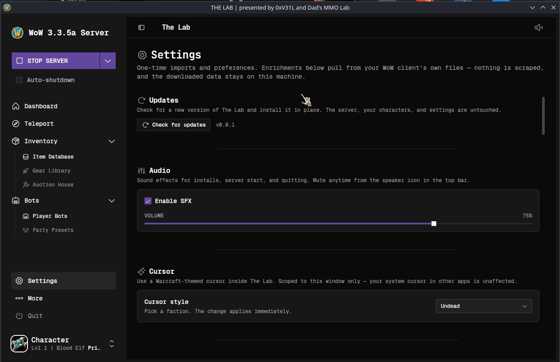

  

<h3 align="center">Your own World of Warcraft world — installed, managed, and played from the couch.</h3>

  Run a private WoW 3.3.5a server on your Steam Deck, fill it with hundreds of AI players,
  build a party of bots, and tweak everything from a friendly, clickable app.
   No terminal. No command line. No guesswork.

  <a href="https://github.com/0xVe1L/the-lab/releases/latest/download/TheLab.AppImage"><b>⬇&nbsp; Download The Lab</b></a>
  &nbsp;·&nbsp;
  <a href="https://github.com/0xVe1L/the-lab/releases/latest">Latest release</a>

---

## What is this?

Setting up a private WoW server is normally a weekend of terminal commands. **The Lab turns it into a few clicks.** It wraps the open-source [AzerothCore](https://www.azerothcore.org/) server and [mod-playerbots](https://github.com/liyunfan1223/mod-playerbots) behind a desktop app built for **people who love games, not developers**.

Install a server, populate your world with AI players, summon a full party of bots, mail yourself any item, teleport anywhere, and fine-tune how it all works — all from Steam Deck Gaming Mode.

> **You bring your own game client.** The Lab only orchestrates open-source server emulators. It never includes, distributes, or links to Blizzard game files — you point it at your own legally-obtained **WoW 3.3.5a (Wrath of the Lich King)** client.

---

## Features

### 🖥 One-click server
- Install a complete WoW 3.3.5a server (AzerothCore + Playerbots) from a **single button** — Docker, database, modules, and bots are all set up for you.
- **Start / stop / restart** with a live, human-readable console — no scrolling raw logs.
- **Auto-shutdown**: the server quits on its own when you close WoW, so it never drains the Deck in the background.
- Built for **Steam Deck Gaming Mode** — add it to Steam and launch it from the couch. (Also runs on Linux desktops; Windows support is on the roadmap.)

### 🧙 Dashboard & your character

- A live **character paper-doll** showing your equipped gear, level, and class.
- **Gear** and **Talents** views in one place, with quick actions.

### 🤖 Bots — the reason we exist

- **Hundreds of AI players** live in your world — they quest, run dungeons, raid, trade, and chat like real people, so a solo server never feels empty.
- **My Party** — build a 5-man group of bots. For each slot you pick a **role → class → spec → talent build → level**, and The Lab spawns the bot, gears it, applies its talents, and teleports it right to you.

  
  

  
  

- **Party Presets** — save a party composition and re-summon the exact same group any time, or share it with friends. Ships with ready-made example parties.
- **Talent trees** — browse any class's full talent layout, exactly like in-game.

- **Global bot settings** — control how many bots populate the world, their level range, what they do (questing, dungeons, battlegrounds), and performance tuning so it stays smooth on a Deck.

### 🎒 Item database & in-game mail

- Search the **entire item database** with quality and class filters, real icons, and full tooltips.
- **Send any item** straight to your character through in-game mail — whether you're online or offline.

### 🌍 Teleport anywhere

- Beam your character to any of **thousands of named locations**, or to exact map coordinates. Save your favorites for one-tap travel.

### 🏷 Auction House bot
- A configurable bot keeps your auction house **stocked and active** so the in-game economy feels alive — all tuned from a friendly UI, with no SQL or config-file editing.

### ⚙ Settings & power tools

  
  

- **Data enrichment** — pulls icons, tooltips, and talent data from *your own* WoW client so everything shows real names and art.
- **Character backup & restore** — portable backup files. Back up before a rebuild, or move characters between installs, without losing progress.
- **Steam integration** — adds The Lab (and your WoW client) to Steam as non-Steam games, complete with artwork, ready for Gaming Mode.
- **Controller support**, **Warcraft cursor themes**, and audio options.
- **Module management** — enable or disable AzerothCore modules and edit their raw configs, then rebuild — all from inside the app.
- **World settings** — adjust XP, gold, drop rates, and other server knobs.
- **Bring an existing server under management** — already set one up the manual way? The Lab detects it and migrates it in, **keeping all your characters and data**.
- **In-app updates** — new versions install in place; your server, characters, and settings are left untouched.

### 🌐 Play Together — *coming soon*
Open your world so friends can hop in with their own characters and keep their progress.

---

## Requirements
- A **Steam Deck** (SteamOS) is the primary target. Also runs on Linux desktops; **Windows support is planned**.
- Your own **WoW 3.3.5a (Wrath of the Lich King)** game client. The Lab never provides game files.
- Roughly **15 GB** of free space for the server.

## Install
1. **[Download `TheLab.AppImage`](https://github.com/0xVe1L/the-lab/releases/latest/download/TheLab.AppImage)** from the latest release.
2. Make it executable and run it — or let the app add itself to Steam so you can launch it from Gaming Mode.
3. Click **Install server** and follow along on screen. The first Playerbots install compiles from source, so grab a coffee — after that, starting up takes seconds.

## About
The Lab is a labor of love for **dads who love games, not developers** — making it dead-simple to relive WoW in your own private world that's full of life. It orchestrates only **open-source emulators** (AzerothCore, mod-playerbots, and friends) and never includes copyrighted game clients or assets.

<i>Presented by <b>0xVe1L</b> and <b>Dad's MMO Lab</b>.</i>

