

  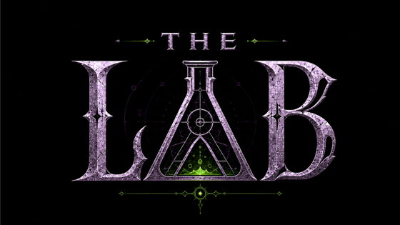

<h1 align="center">THE LAB: Your own World of Warcraft server — installed, managed, and played from the couch.</h3>

  Run a private WoW 3.3.5a server on your Steam Deck, fill it with hundreds of AI players,
  build a party of bots, and tweak everything from a friendly, clickable app.
   No terminal. No command line. No guesswork.

  <b>First public release coming soon.</b>  Watch or ⭐ the repo to be notified when downloads go live.

  <b>Latest release</b> (coming soon)
  &nbsp;·&nbsp;
  <a href="#install"><b>Installation instructions</b></a>

 

## What is this?

Setting up a private WoW server is normally a weekend of terminal commands. **The Lab turns it into a few clicks.** It wraps the open-source [AzerothCore](https://www.azerothcore.org/) server and [mod-playerbots](https://github.com/liyunfan1223/mod-playerbots) behind a desktop app built for **people who love games, not developers**.

Install a server, populate your world with AI players, summon a full party of bots, mail yourself any item, teleport anywhere, and fine-tune how it all works — all from Steam Deck Gaming Mode.

> **You bring your own game client.** The Lab only orchestrates open-source server emulators. It never includes, distributes, or links to Blizzard game files — you point it at your own legally-obtained **WoW 3.3.5a (Wrath of the Lich King)** client. (These are easily located).

 
 

<h1 align="center">🧪 &nbsp;&nbsp;  Features  &nbsp;&nbsp;  🧪</h1>

 

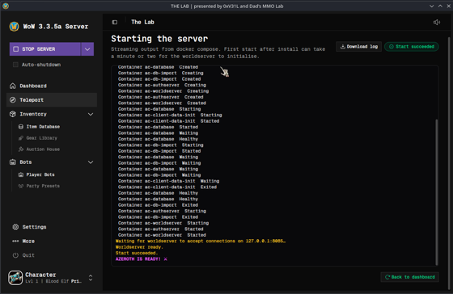

### 🖥 One-click server
- Install a complete WoW 3.3.5a server (AzerothCore + Playerbots) from a **single button** — Docker, database, modules, and bots are all set up for you.
- **Start / stop / restart** with a live, human-readable console — no scrolling raw logs.
- **Auto-shutdown**: the server quits on its own when you close WoW, so it never drains the Deck in the background.
- Built for **Steam Deck Gaming Mode** — add it to Steam and launch it from the couch. (Also runs on Linux desktops; Windows support is on the roadmap.)
 
 

---

 

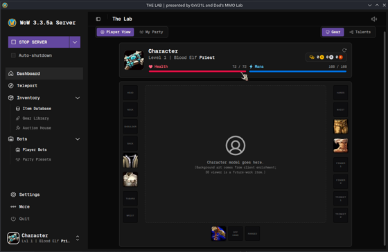

### 🧙 Dashboard & your character
- A live **character paper-doll** showing your equipped gear, level, and class.
- **Gear** and **Talents** views in one place, with quick actions.
 
 

---

 

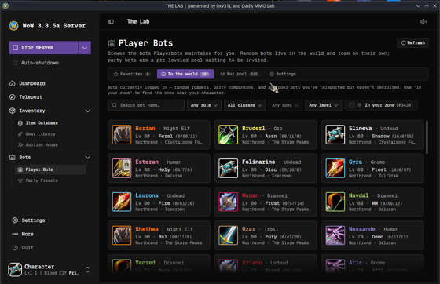

### 🤖 Bots — the reason we exist

- **Hundreds of AI players** live in your world — they quest, run dungeons, raid, trade, and chat like real people, so a solo server never feels empty.
- **My Party** — build a 5-man group of bots. For each slot you pick a **role → class → spec → talent build → level**, and The Lab spawns the bot, gears it, applies its talents, and teleports it right to you. *Support for larger raid groups is on the way.*
 
 

---

 

  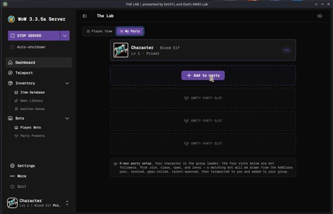
  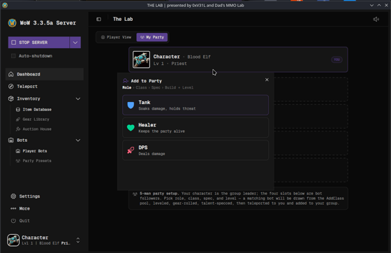

  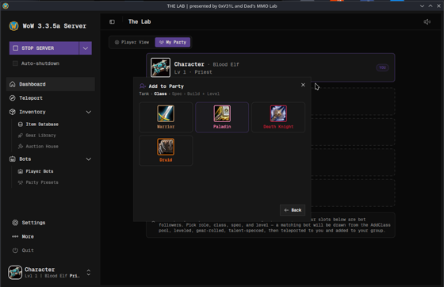
  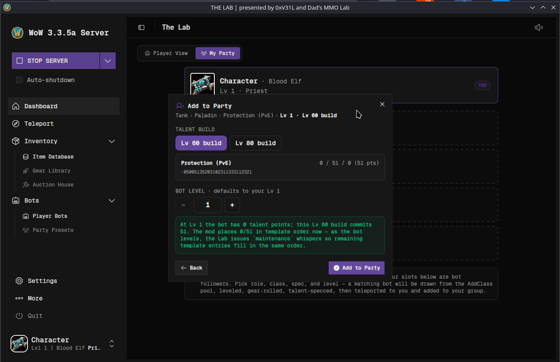

- **Party Presets** — save a party composition and re-summon the exact same group any time, or share it with friends. Ships with ready-made example parties.

- **Talent trees** — browse any class's full talent layout, exactly like in-game.
  

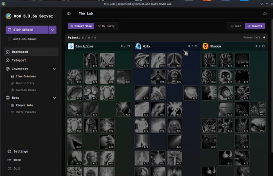

- **Global bot settings** — control how many bots populate the world, their level range, what they do (questing, dungeons, battlegrounds), and performance tuning so it stays smooth on a Deck.
 
 

---

 

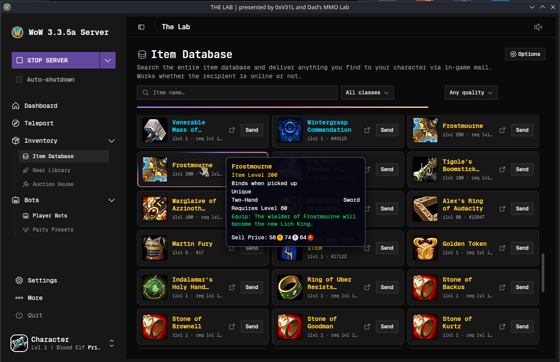

### 🎒 Item database & in-game mail

- Search the **entire item database** with quality and class filters, real icons, and full tooltips.
- **Send any item** straight to your character through in-game mail — whether you're online or offline.
 
 

---

 

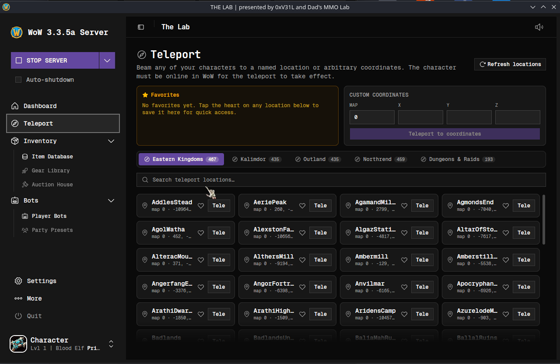

### 🌍 Teleport anywhere

- Beam your character to any of **thousands of named locations**, or to exact map coordinates. Save your favorites for one-tap travel.
 
 

---

 

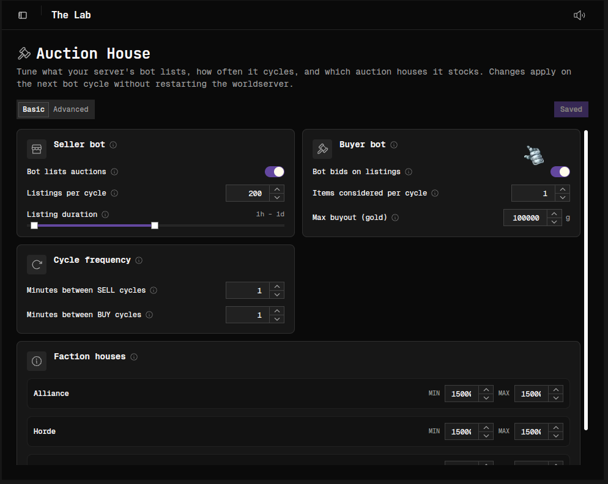

### 🏷 Auction House bot

- Powered by **[AH Bot Plus](https://github.com/AnchyDev/AHBotPlus)**, a bot that keeps your auction house **stocked and active** so the in-game economy feels alive — all tuned from a friendly UI, with no SQL or config-file editing.
- Control the **seller bot** (how many listings per cycle, listing duration) and the **buyer bot** (items considered per cycle, max buyout), set how often each cycle runs, and tune per-faction house sizes — with **Basic** and **Advanced** views. Changes apply on the next bot cycle, no server restart needed.
 
 

---

 

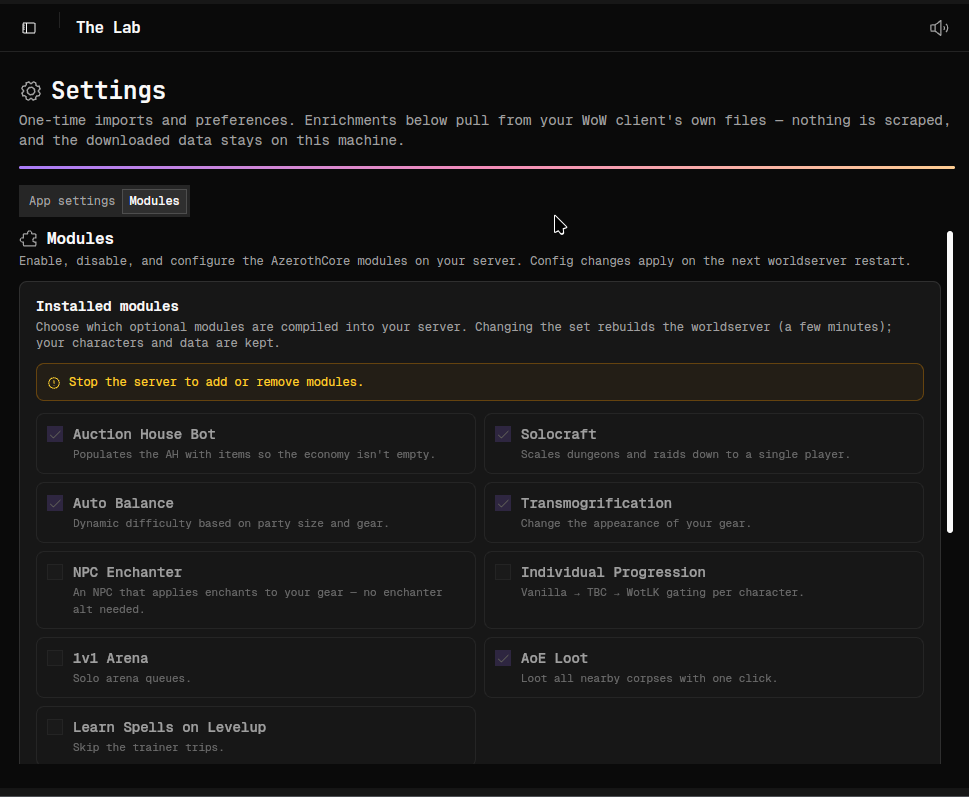

### 🧩 Modules & their settings

- **Pick your features.** Choose which optional AzerothCore modules are compiled into your server — Auction House Bot, Solocraft, Auto Balance, Transmogrification, Individual Progression, AoE Loot, and more. Changing the set rebuilds the worldserver (a few minutes); **your characters and data are kept.**

- **Tune each module.** Edit a module's raw config right inside the app — changes are staged until you press **Apply**, then take effect on the next restart. No digging through `.conf` files on disk.

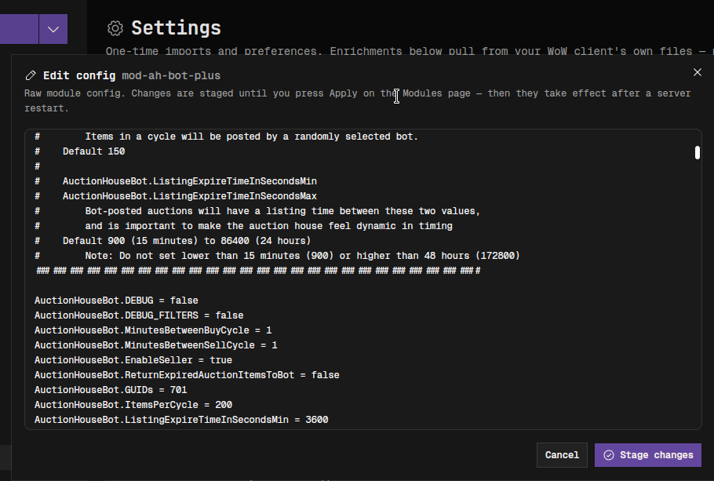

 
 

---

 

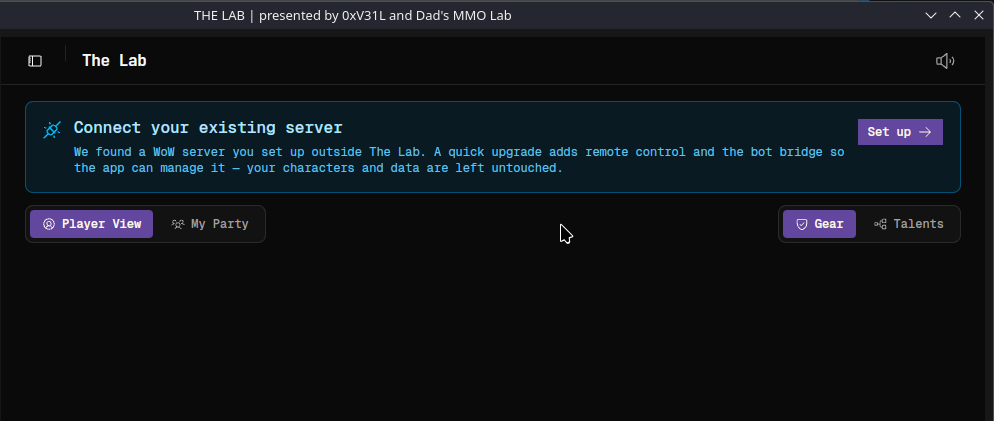

### 🔌 Migrate your existing Dad's MMO Lab server

- Already set up a server the manual way? The Lab **detects it and migrates it in** with a quick upgrade that adds remote control and the bot bridge — so the app can manage it while **your characters and data are left untouched.**
 
 

---

 

### ⚙ Settings & power tools
- **Data enrichment** — pulls icons, tooltips, and talent data from *your own* WoW client so everything shows real names and art.
- **Character backup & restore** — portable backup files. Back up before a rebuild, or move characters between installs, without losing progress.
- **Steam integration** — adds The Lab (and your WoW client) to Steam as non-Steam games, complete with artwork, ready for Gaming Mode.
- **Controller support**, **Warcraft cursor themes**, and audio options.
- **World settings** — adjust XP, gold, drop rates, and other server knobs.
- **In-app updates** — new versions install in place; your server, characters, and settings are left untouched.
 
 

# 🌐 Play Together — *coming soon*
Open your world so friends can hop in with their own characters and keep their progress. A revolutionary new way to experience the world's *favorite* classic MMO experience.
 
 

## Requirements
- A **Steam Deck** (SteamOS) is the primary target. Also runs on Linux desktops; **Windows support is planned**.
- Your own **WoW 3.3.5a (Wrath of the Lich King)** game client. The Lab never provides game files.
- Roughly **15 GB** of free space for the server.
 
 

## Install

The whole setup is done **once** in Desktop Mode, then you play from Gaming Mode. Follow these steps in order — nothing here is left to guesswork.

1. **Switch to Desktop Mode.** On the Steam Deck, press **STEAM → Power → Switch to Desktop**. You'll land on a normal Linux desktop.

2. **Set a password.** Open **Konsole** (the terminal app, in the taskbar or app menu), type `passwd`, and press Enter. Choose a password and confirm it. *Steam Decks ship without one, and The Lab needs it to install the server with the right permissions.* You only need to do this once, so if you already have a root password, you can skip this.

3. **Get your WoW 3.3.5a client.** Obtain a **Wrath of the Lich King (3.3.5a)** client of your choice and keep it somewhere you can find it. *The Lab never provides game files — you supply your own legally-obtained client.*

4. **Download The Lab.** Once the first release is out, grab **`TheLab.AppImage`** from the releases page and move it somewhere permanent — a folder like **`Home → MyGames`** works great. (Don't run it from the Downloads folder.) *(Downloads aren't available yet — the first public release is coming soon.)*

5. **Make it runnable, then open it.** Right-click `TheLab.AppImage` → **Properties** → the **Permissions** tab → check **"Is executable"** → **OK**. Now **double-click it** to launch. *(One-time step — an AppImage won't open until it's marked executable.)*

   > **Advanced users:** if you've enabled **Developer Mode** in KDE Plasma (or already allow executing programs by default), AppImages may just run on double-click and you can skip the checkbox. When in doubt, do it anyway — it never hurts.

6. **Install your server.** The app walks you through it — click **Install server** and follow along on screen. The first Playerbots install compiles from source, so grab a coffee; after that, starting up takes seconds.

7. **Add to Steam in one click.** Open **Settings** and use **Add to Steam** — it adds both **The Lab** and your **WoW client** to Steam as non-Steam games, with artwork.

8. **Back to the couch.** Return to **Gaming Mode** (the **Return to Gaming Mode** shortcut on the desktop). The Lab and your WoW client are now in your Steam library — start, manage, and play your server entirely from Gaming Mode. 🎮

 

## Troubleshooting & FAQ

<b>I double-click <code>TheLab.AppImage</code> and nothing happens.</b>

It needs to be marked as runnable first. Right-click it → **Properties** → **Permissions** tab → check **"Is executable"** → **OK**, then double-click again. This is a one-time step the very first time you open it.

*Already opened on the first try? You likely have Developer Mode enabled (or your file manager allows running programs by default), so you can ignore this — nothing's wrong.*

<b>It's asking for a password during install.</b>

That's the password you set with `passwd` in Konsole (Step 2). Type it in to let the installer set up Docker and the server. If you never set one, go back to Desktop Mode, open Konsole, run `passwd`, and try again.

<b>The first install is taking forever.</b>

That's normal. The Playerbots server **compiles from source** the first time, which can take an hour or more on a Steam Deck. Leave it running. After that first build, starting the server takes only seconds.

<b>Do I need an internet connection?</b>

Yes for the **install** (it downloads and builds the server). Once it's set up, the server runs **locally on your machine** — you and your bots are playing offline.

<b>Where do I get the WoW client? Is it included?</b>

It's **not** included — The Lab never distributes game files. You bring your own legally-obtained **WoW 3.3.5a (Wrath of the Lich King)** client and point The Lab at it.

<b>My server stopped working after a SteamOS update.</b>

SteamOS updates can break Docker. The Lab detects this and offers a **one-click fix** — follow the prompt and you'll be back up without losing anything.

<b>Will updating The Lab wipe my characters?</b>

No. Updates install in place and your server, characters, and settings are left untouched. You can also make portable **character backups** any time from **Settings**.

<b>How do I stop the server?</b>

Use the **Stop server** button in the app — or just turn on **Auto-shutdown**, and the server stops on its own when you close WoW.

<b>Can I play with friends?</b>

Not yet — **Play Together** is coming soon. Today The Lab is built for your own private, bot-filled world.

 

## About
The Lab is a labor of love for **dads who love games, not developers** — making it dead-simple to relive WoW in your own private world that's full of life. It orchestrates only **open-source emulators** (AzerothCore, mod-playerbots, and friends) and never includes copyrighted game clients or assets.

<i>Presented by <b>0xVe1L</b> and <a href="https://github.com/DadsMmoLab/dads-mmo-lab"><b>Dad's MMO Lab</b></a>.</i>

<i>Special thanks to the members of the Dad's MMO Lab Discord for testing and support &lt;3</i>

